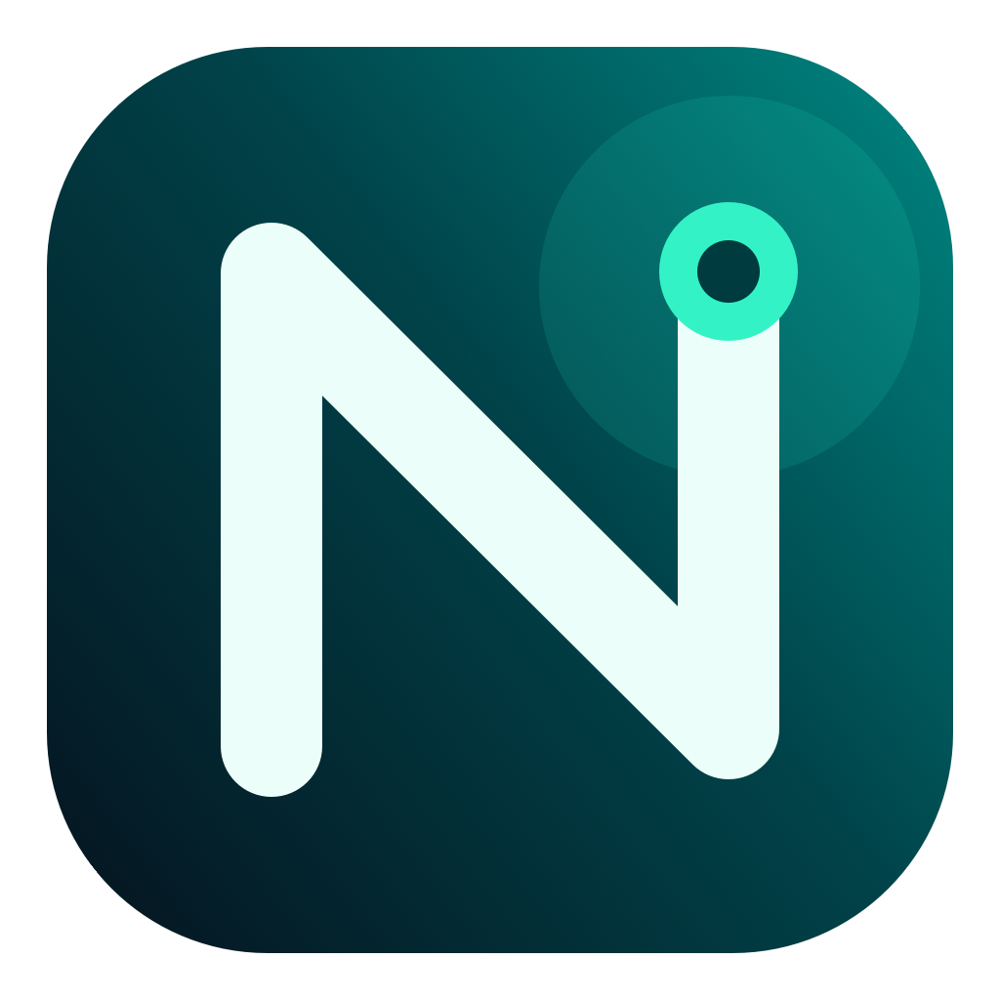
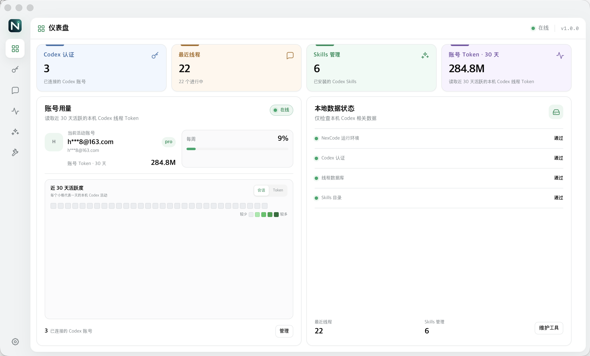
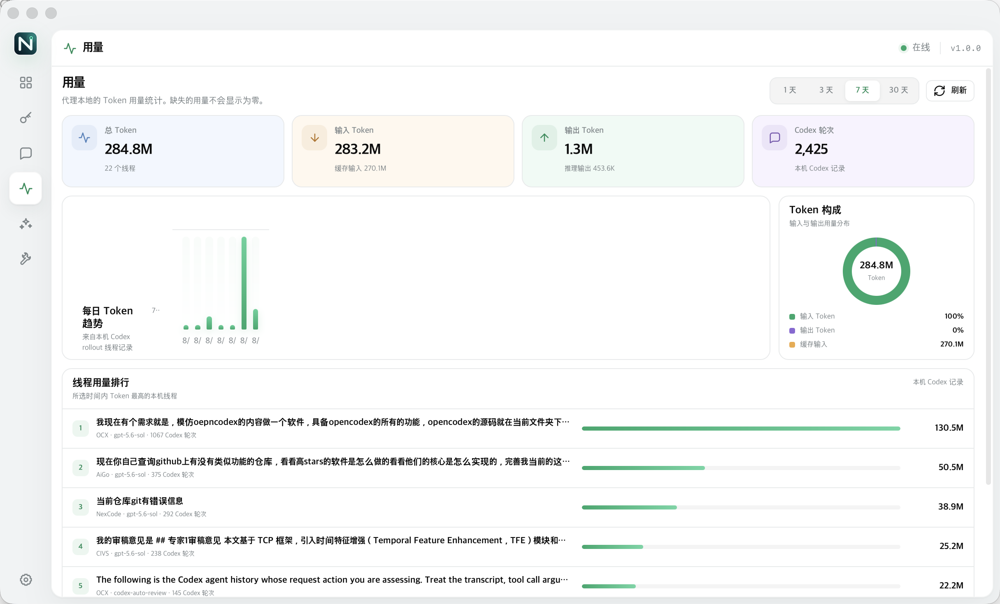

<p align="center">
  
</p>

<h1 align="center">NexCode</h1>

<p align="center">
  <strong>在一个 macOS 桌面应用里，管理 Codex 账号、线程、用量与 Skills。</strong><br>
  <strong>Manage Codex accounts, threads, usage, and Skills in one macOS desktop app.</strong>
</p>

<p align="center">
  <a href="#中文">中文</a> · <a href="#english">English</a>
</p>

<p align="center">
  
</p>

---

## 中文

NexCode 是一款面向 Codex 用户的原生 macOS 桌面软件。它把分散在本机文件、
数据库和命令行中的账号、对话线程、Token 用量与 Skills 汇总到一个清晰的管理界面中，
并随应用启动所需的本地运行环境。

日常使用不需要打开浏览器，也不需要手动查找 Codex 的本地数据文件。除登录授权外，
账号管理、线程查看、用量统计、Skills 管理和维护操作都可以直接在 NexCode 中完成。

### 核心功能

#### 1. Codex 多账号管理

- 连接并集中管理多个 ChatGPT / Codex 账号。
- 查看账号状态、套餐信息和可用配额。
- 选择新会话要使用的活动账号，无需反复修改本地配置。
- 登录凭据与运行数据保存在本机 `~/.nexcode`，也可通过 `NEXCODE_HOME` 更改目录。

#### 2. 本地线程中心

- 自动读取本机 Codex 对话线程。
- 按标题、项目、模型或线程 ID 搜索。
- 查看渲染后的完整对话，并按线程状态筛选。
- 导出需要保留或分享的线程内容。

#### 3. Token 用量分析

- 按 1 天、3 天、7 天或 30 天查看本机 Codex 用量。
- 分别统计输入、输出、缓存输入与推理 Token。
- 展示每日趋势、Token 构成和高用量线程排行。
- 统计数据直接来自本机 Codex 线程记录，不把缺失数据误显示为零。

<p align="center">
  
  <br>
  <sub>按时间范围查看 Token 趋势、构成与线程排行</sub>
</p>

#### 4. Codex Skills 管理

- 统一查看 Codex 发现的个人、项目和内置 Skills。
- 新建、查看和编辑 Skill，也可将不再需要的 Skill 移入可恢复回收区。
- 按名称、说明或路径搜索，同时保护内置及嵌套 Skills，避免误改。

#### 5. 一键诊断与维护

- 检查 Codex 配置、认证、线程数据库、Skills 目录和 NexCode 运行环境。
- 修复启动器、模型目录、运行缓存及可识别的第三方代理配置冲突。
- 清理冗余认证备份、旧目录备份和失效快照，同时保留当前认证与活动数据。

#### 6. 原生 macOS 使用体验

- 使用 WebKit 提供独立原生窗口，不把管理界面跳转到浏览器。
- 自动启动内置运行环境并发现可用的本地端口。
- OAuth 登录在系统浏览器中完成，随后通过 `nexcode://` 自动返回应用。
- 提供独立 `.app` 与可拖入“应用程序”目录的 `.dmg` 安装镜像。

### 数据范围

NexCode 的线程和用量页面只读取本机 Codex 记录。软件不会把没有归属信息的 Token
重复分摊到各账号，也不会把缺失统计当作零。模型请求仍会按你的账号和配置发送到
相应的上游服务；使用第三方服务前，请确认其当前条款允许相应的接入方式。

### 安装与构建

macOS 用户可从 [Releases](https://github.com/jasonlee539/NexCode/releases)
获取已发布的应用。

从源码构建需要 macOS 13 或更高版本、Node.js 18+ 和 Apple Command Line Tools：

```bash
npm install --no-audit --no-fund
npm run desktop:build
open dist/NexCode.app
```

构建产物为 `dist/NexCode.app`。如需生成可拖入“应用程序”目录的安装镜像：

```bash
npm run desktop:dmg
```

安装镜像将写入 `dist/NexCode.dmg`。应用包内已包含 Bun、代理源码、生产版管理界面
和运行依赖，移出源码目录后仍可独立运行。

---

## English

NexCode is a native macOS desktop app for Codex users. It brings accounts,
conversation threads, token usage, and Skills—normally spread across local
files, databases, and command-line tools—into one focused interface. The app
also starts the local runtime required for its Codex integration.

There is no browser dashboard to keep open and no need to locate Codex data
files manually. Apart from browser-based sign-in, account management, thread
inspection, usage analysis, Skills management, and maintenance all happen
inside NexCode.

### Core features

#### 1. Multiple Codex accounts

- Connect and manage multiple ChatGPT / Codex accounts in one place.
- Review account status, plan information, and available quota.
- Choose the active account for new sessions without repeatedly editing local configuration.
- Keep credentials and runtime data under `~/.nexcode`, or set `NEXCODE_HOME` to use another directory.

#### 2. Local thread library

- Discover conversations from the local Codex thread database automatically.
- Search by title, project, model, or thread ID.
- Filter thread states and read a rendered version of the full conversation.
- Export threads that need to be archived or shared.

#### 3. Token usage analytics

- Inspect local Codex usage over 1, 3, 7, or 30 days.
- Separate input, output, cached-input, and reasoning tokens.
- See daily trends, token composition, and the highest-usage threads.
- Read usage directly from local Codex records without presenting missing data as zero.

<p align="center">
  
  <br>
  <sub>Token trends, composition, and thread rankings for the selected period</sub>
</p>

#### 4. Codex Skills management

- Browse personal, project, and built-in Skills discovered by Codex.
- Create, inspect, and edit Skills, or move unused Skills to recoverable trash.
- Search by name, description, or path while protecting bundled and nested Skills from accidental changes.

#### 5. Diagnostics and maintenance

- Check Codex configuration, authentication, thread storage, Skills directories, and the NexCode runtime.
- Repair launcher state, managed model catalogs, runtime caches, and recognized third-party proxy conflicts.
- Remove redundant authentication backups, old directory backups, and stale snapshots while preserving current credentials and active data.

#### 6. Native macOS experience

- Run in a dedicated native WebKit window instead of redirecting the dashboard to a browser.
- Start the bundled runtime and discover an available local port automatically.
- Complete OAuth in the system browser and return to the app through the `nexcode://` protocol.
- Use NexCode as a standalone `.app` or install it from a drag-to-Applications `.dmg` image.

### Data scope

The thread and usage views read local Codex records only. NexCode does not
duplicate unattributed token totals across accounts or represent missing usage
as zero. Model requests still go to the appropriate upstream service according
to your account and configuration. Review a third-party service's current terms
before connecting it.

### Install and build

macOS users can download published builds from
[Releases](https://github.com/jasonlee539/NexCode/releases).

Building from source requires macOS 13 or newer, Node.js 18+, and Apple Command
Line Tools:

```bash
npm install --no-audit --no-fund
npm run desktop:build
open dist/NexCode.app
```

The application is written to `dist/NexCode.app`. To create a
drag-to-Applications installer image, run:

```bash
npm run desktop:dmg
```

The installer is written to `dist/NexCode.dmg`. The app bundles Bun, the proxy
source, the production dashboard, and runtime dependencies, so it remains
self-contained after being moved out of the source directory.

---

## Project structure / 项目结构

- `desktop/` — native macOS host, branding assets, and `.app` / `.dmg` packaging scripts
- `gui/` — React + Vite desktop interface
- `src/` — Bun TypeScript runtime, Codex integration, and management API
- `tests/` — runtime and GUI regression tests
- `docs-site/` — product documentation source

## License / 许可

NexCode is an independent derivative work. Parts of the underlying
implementation originate from the MIT-licensed OpenCodex project. The original
copyright notices and full license text are preserved in [LICENSE](LICENSE),
with derivative-work details in [NOTICE](NOTICE).

NexCode 是独立的派生作品。部分底层实现源自 MIT 许可的 OpenCodex，原版权声明和
许可全文保留在 [LICENSE](LICENSE)，派生说明见 [NOTICE](NOTICE)。

NexCode is not affiliated with or endorsed by OpenAI, Anthropic, or any model
provider. / NexCode 与 OpenAI、Anthropic 或任何模型服务商均无隶属或背书关系。
